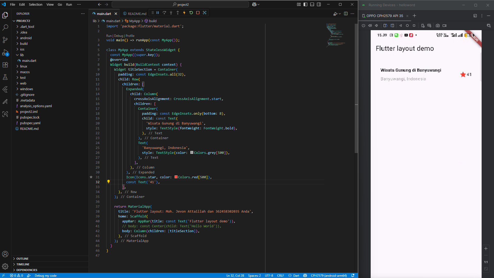
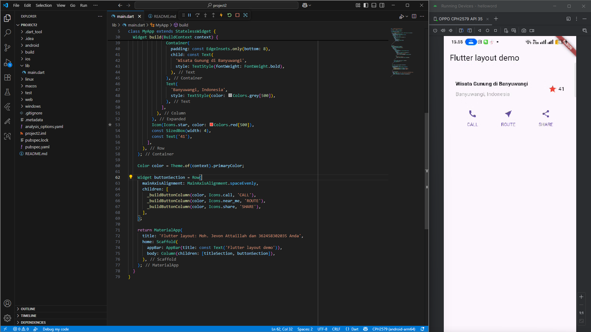
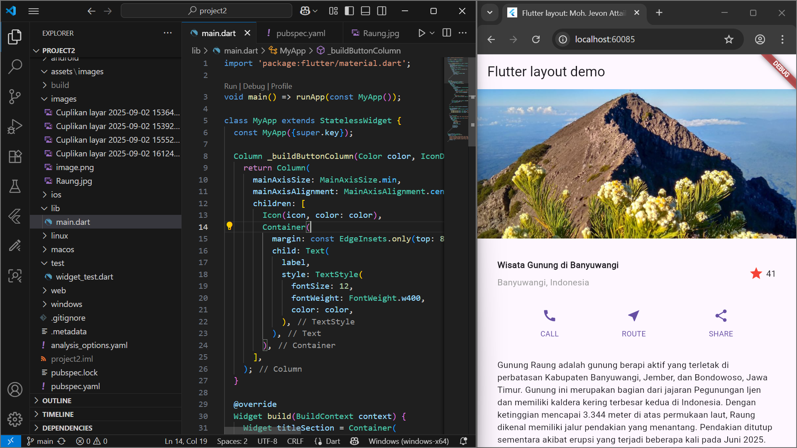

# project2
## Praktikum 1: Membangun Layout di Flutter
Pada tahap ini, struktur awal aplikasi dibentuk menggunakan widget `Row`, `Column`, dan `Container`. Layout terdiri dari elemen judul, lokasi, dan rating yang ditampilkan secara horizontal. Komponen yang diimplementasikan:
- Judul wisata: **Wisata Gunung di Banyuwangi**
- Lokasi: **Banyuwangi, Indonesia**
- Rating: Ikon bintang merah dan angka **41**

Teknik yang digunakan:
- `Expanded` untuk mengatur ruang kolom teks
- `crossAxisAlignment: CrossAxisAlignment.start` untuk meratakan teks ke kiri
- `SizedBox(width: 4)` untuk memberi jarak antara ikon dan angka

## Praktikum 2:Implementasi button row
Tahapan ini menambahkan tiga tombol interaktif: CALL, ROUTE, dan SHARE. Setiap tombol terdiri dari ikon dan teks yang ditata secara vertikal, kemudian disusun horizontal menggunakan `Row`.

Komponen yang diimplementasikan:
- Fungsi `_buildButtonColumn()` untuk membangun tombol secara dinamis
- `MainAxisAlignment.spaceEvenly` untuk menyebar tombol secara merata

Teknik yang digunakan:
- `Icon()` dan `Text()` dibungkus dalam `Column`
- `Container(margin: EdgeInsets.only(top: 8))` untuk memberi jarak antara ikon dan teks

## Praktikum 3:Implementasi text section
Bagian ini menampilkan deskripsi wisata Gunung Raung. Teks dibungkus dalam `Container` dengan padding agar nyaman dibaca. Properti `softWrap` digunakan agar teks membungkus otomatis sesuai lebar layar.

Konten teks menjelaskan lokasi, karakteristik kaldera, dan status pendakian Gunung Raung.

## Praktikum 4:Implementasi image section
Tahapan ini menambahkan gambar wisata sebagai elemen visual utama. Gambar ditampilkan menggunakan `Image.asset()` dan diletakkan di bagian atas layout.

Komponen yang diimplementasikan:
- Gambar `Raung.jpg` dari folder `images/`
- Properti `BoxFit.cover` agar gambar memenuhi area tampilan dengan proporsi yang sesuai

Penyesuaian akhir:
- Layout diubah dari `Column` menjadi `ListView` agar dapat di-scroll pada perangkat dengan layar kecil

